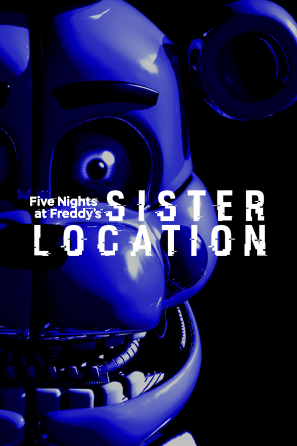
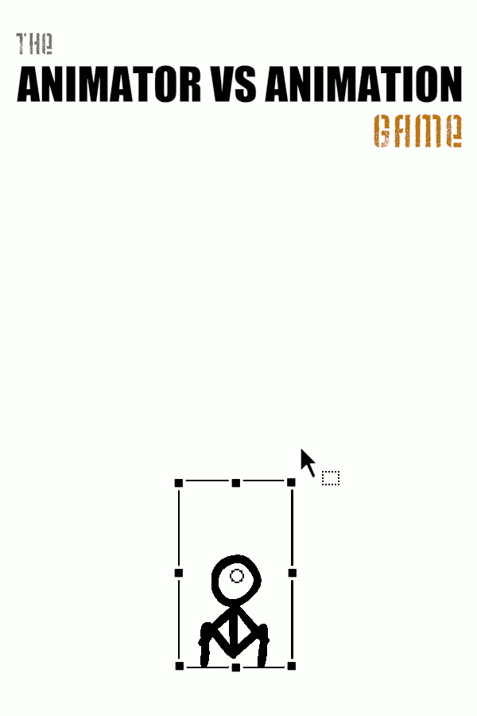
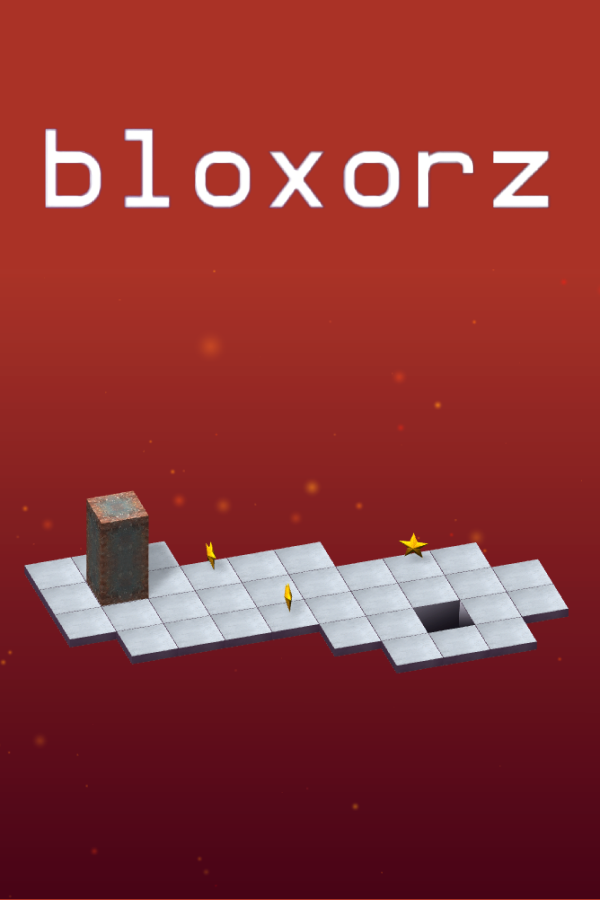
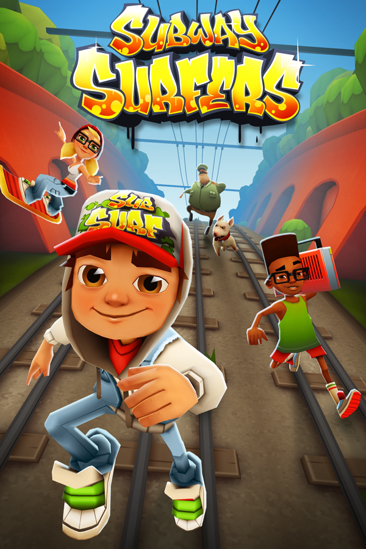
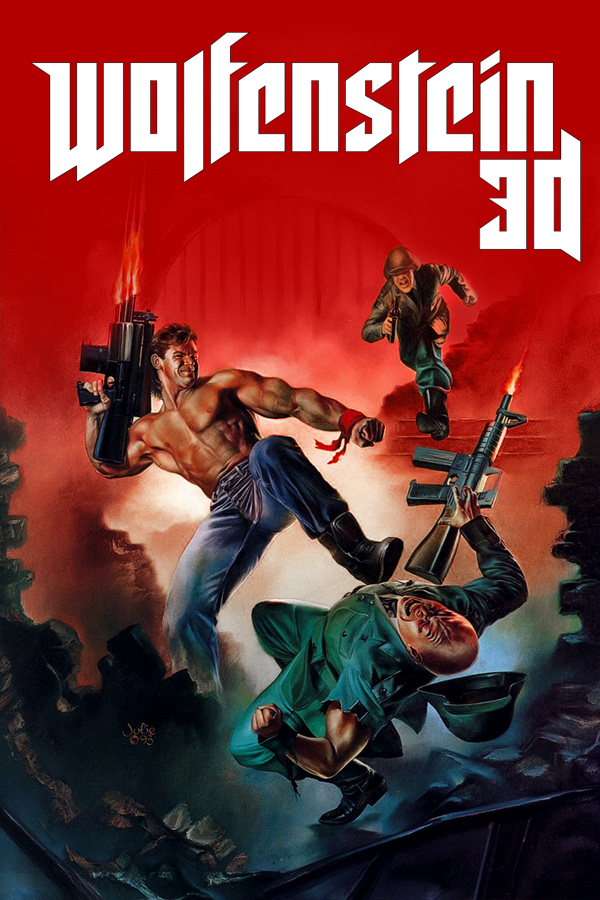
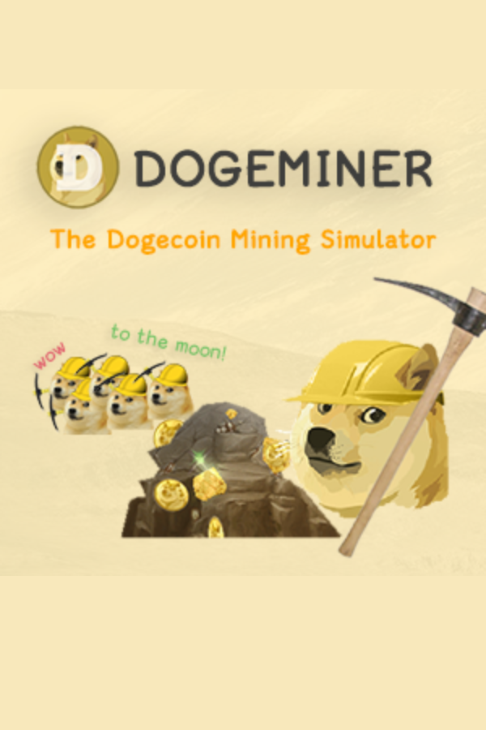

# Yeet 

A custom g*me compilation site. (will contain a link to Biology Homework)

## Deploy your own version!

To make your own version of this website, you will require these things.

- A GitHub Account (or Replit, Heroku, Azure, Glitch, etc.)

That's it. 

Now, how do you make your own custom version of this website?

### GitHub Pages Method

To deploy your very own version of Yeet on GitHub Pages, you will need a GitHub account.

Click on the Fork button and type in a name for your forked repo. 


Wait for the files to be copied over and it will deploy to GitHub Pages automatically (hopefully)

The format for your fork will be ```https://USERNAME.github.io/FORKNAME```

No extra code modifications necessary! It's fork and deploy and that's it!


Here is an example fork on my main account! Visit it here: [Official Yeet Fork](https://github.com/joalricha869/yeet)

### Other Deployers

You will require an account for the platform you choose to fork this repo to.

To make it easy to fork this repo to another platform such as Replit, I provided special buttons which will make a repo with the files of this GitHub repo!

[](https://heroku.com/deploy/?template=https://github.com/DingusOrg/yeet)
[](https://replit.com/github/DingusOrg/yeet)
[](https://glitch.com/edit/#!/import/github/DingusOrg/yeet)
[](https://vercel.com/new/clone?repository-url=https://github.com/DingusOrg/yeet)


These g*mes are in the website (or will be soon!) 💀

<p>
   
   
   
   
   
   
</p>
<p>
   
   
   
   
   
   
   
</p>
<p>
   
   
   
   
   
   
   
   
</p>
<p>
   
   
   
   
   
   
   
</p>
<p>
   
   
   
   
   
   
   
</p>
<p>
   
   
</p>

G*mes from:

[lioxryt](https://github.com/lioxryt/other)

[scratch and htmlifier](https://sheeptester.github.io/htmlifier/)

other sources lol
